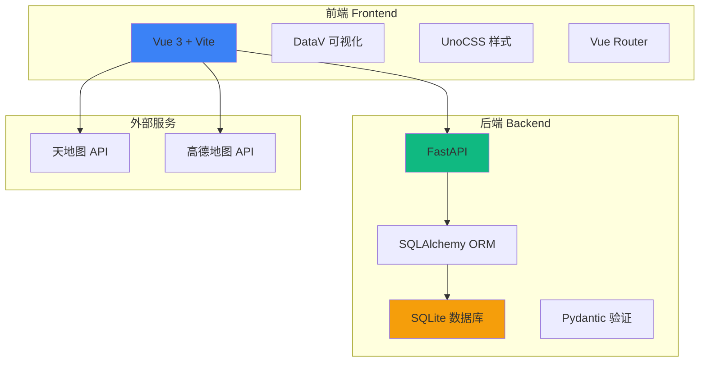

# 沈西所警情态势演示系统

> **文档生成时间**：2026-01-22 18:59:55 CST
> **项目类型**：演示 Demo（前后端分离）
> **技术栈**：Vue 3 + FastAPI + SQLite
> **核心目标**：界面美观 > 交互正常 > 数据准确

---

## 📋 项目概述

这是一个面向浙江省舟山市普陀区沈��派出所的警情态势演示系统，用于甲方 UI 方案确定。系统展示警情态势、案件管理和纠纷调解功能。

### 关键特性
- 🗺️ 天地图集成 - 可视化社区警情分布
- 📊 实时态势展示 - 案件和纠纷统计
- ⚠️ 超期提醒 - 红色高亮显示超期项目
- 🎨 警务蓝 UI - 科技感渐变、毛玻璃效果
- 🔄 前后端分离 - Vue 3 前端 + FastAPI 后端

---

## 🏗️ 项目架构



---

## 📦 模块索引

### 前端模块 (`/frontend`)
- **入口**: `src/main.js`
- **路由**: `src/router/index.js`
- **视图**: `src/views/`
- **组件**: `src/components/`
- **API**: `src/api/`
- **详细文档**: [frontend/CLAUDE.md](frontend/CLAUDE.md)

### 后端模块 (`/backend`)
- **入口**: `main.py`
- **核心**: `app/core/`
- **API**: `app/api/`
- **模型**: `app/models/`
- **详细文档**: [backend/CLAUDE.md](backend/CLAUDE.md)

---

## 🛠️ 技术栈

### 前端技术
| 技术 | 版本 | 用途 |
|------|------|------|
| Vue 3 | ^3.4.0 | 前端框架 |
| Vite | ^5.0.0 | 构建工具 |
| Vue Router | ^4.6.4 | 路由管理 |
| DataV Vue3 | ^1.7.0 | 数据可视化 |
| UnoCSS | ^0.58.0 | 原子化 CSS |

### 后端技术
| 技术 | 版本 | 用途 |
|------|------|------|
| FastAPI | >=0.104.0 | Web 框架 |
| SQLAlchemy | >=2.0.0 | ORM |
| Pydantic | >=2.5.0 | 数据验证 |
| Uvicorn | >=0.24.0 | ASGI 服务器 |
| Pandas | >=2.1.0 | 数据处理 |

---

## 🚀 快速开始

### 前端启动
```bash
cd frontend
npm install
npm run dev  # http://localhost:3000
```

### 后端启动
```bash
cd backend
python -m venv .venv
source .venv/bin/activate  # Windows: .venv\Scripts\activate
pip install -e .
python main.py  # http://localhost:8000
```

### API 文档
- Swagger UI: http://localhost:8000/docs
- ReDoc: http://localhost:8000/redoc

---

## 📁 目录结构

```
police-alert/
├── frontend/              # 前端项目
│   ├── src/
│   │   ├── views/        # 页面组件
│   │   │   ├── Home.vue       # 首页
│   │   │   ├── Situation.vue  # 警情态势
│   │   │   ├── Cases.vue      # 案件管理
│   │   │   └── Disputes.vue   # 纠纷调解
│   │   ├── components/   # 通用组件
│   │   ├── api/          # API 请求
│   │   ├── router/       # 路由配置
│   │   └── data/         # Mock 数据
│   ├── package.json
│   ├── vite.config.js
│   └── uno.config.js
│
├── backend/              # 后端项目
│   ├── app/
│   │   ├── api/          # API 路由
│   │   ├── core/         # 核心配置
│   │   ├── models/       # 数据模型
│   │   ├── schemas/      # Pydantic 模式
│   │   ├── services/     # 业务逻辑
│   │   └── utils/        # 工具函数
│   ├── main.py           # 应用入口
│   ├── pyproject.toml
│   └── data.db           # SQLite 数据库
│
└── CLAUDE.md             # 本文档
```

---

## 🎨 设计规范

### 颜色主题
- **主色调**: `#1e3a8a` (police-blue) - 深蓝色
- **辅助色**: `#3b82f6` (police-light) - 亮蓝色
- **渐变**: 蓝色系渐变，营造科技感
- **毛玻璃**: `backdrop-filter: blur()` 效果

### UI 组件
- 使用 DataV Vue3 数据可视化组件
- UnoCSS 原子化样式
- Remix Icon 图标库

---

## 🔌 API 接口

### 配置管理
- `GET /api/v1/config/tianditu-key` - 获取天地图 API Key
- `POST /api/v1/config/tianditu-key` - 设置天地图 API Key
- `GET /api/v1/config/amap-key` - 获取高德地图 API Key
- `POST /api/v1/config/amap-key` - 设置高德地图 API Key

### 健康检查
- `GET /health` - 健康检查
- `GET /` - API 根路径

---

## 📝 开发规范

### 前端开发
1. 使用 Vue 3 Composition API
2. 逐个页面开发，小步迭代
3. 一个页面完成再开发下一个
4. 遵循 UnoCSS 原子化样式
5. 使用 DataV 组件进行数据可视化

### 后端开发
1. 遵循 FastAPI 最佳实践
2. 使用 Pydantic 进行数据验证
3. SQLAlchemy ORM 操作数据库
4. 异步编程优先
5. 完善的错误处理

### 代码风格
- 前端: ESLint + Prettier
- 后端: Black + isort
- 提交信息: Conventional Commits

---

## 🔒 环境变量

### 后端 `.env`
```env
# 应用配置
APP_NAME=警情态势演示系统
APP_VERSION=1.0.0
DEBUG=True

# 数据库
DATABASE_URL=sqlite:///./data.db

# API Keys
TIANDITU_API_KEY=your_key_here
AMAP_API_KEY=your_key_here

# 文件上传
UPLOAD_DIR=./uploads
MAX_UPLOAD_SIZE=10485760

# CORS
CORS_ORIGINS=["http://localhost:5173", "http://localhost:3000"]
```

---

## 📊 数据模型

### 配置表 (Config)
- `key`: 配置键（主键）
- `value`: 配置值
- `description`: 配置描述
- `created_at`: 创建时间
- `updated_at`: 更新时间

---

## 🧪 测试

### 前端测试
```bash
cd frontend
npm run test  # 单元测试
npm run e2e   # E2E 测试
```

### 后端测试
```bash
cd backend
pytest  # 运行测试
pytest --cov  # 测试覆盖率
```

---

## 📚 相关资源

- [Vue 3 文档](https://vuejs.org/)
- [FastAPI 文档](https://fastapi.tiangolo.com/)
- [DataV Vue3](https://github.com/kjgl77/datav-vue3)
- [UnoCSS 文档](https://unocss.dev/)
- [天地图 API](https://lbs.tianditu.gov.cn/)

---

## 🤝 贡献指南

1. Fork 项目
2. 创建特性分支 (`git checkout -b feature/AmazingFeature`)
3. 提交更改 (`git commit -m 'Add some AmazingFeature'`)
4. 推送到分支 (`git push origin feature/AmazingFeature`)
5. 开启 Pull Request

---

## 📄 许可证

本项目仅用于演示目的。

---

## 📞 联系方式

如有问题，请联系项目维护者。
