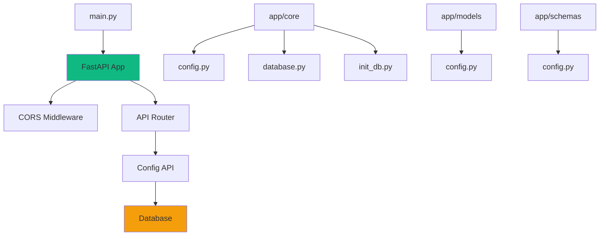

# Backend - 警情态势演示系统后端

> **导航**: [← 返回根目录](../CLAUDE.md) / Backend
> **模块职责**: 提供 RESTful API、数据持久化、地理编码服务
> **技术栈**: FastAPI + SQLAlchemy + SQLite + Pydantic

---

## 📋 模块概述

后端采用 FastAPI 框架，提供高性能的异步 API 服务。使用 SQLAlchemy ORM 进行数据库操作，Pydantic 进行数据验证。

### 核心功能
- ✅ 配置管理 API
- ✅ 数据库自动初始化
- ✅ CORS 跨域支持
- ✅ API 文档自动生成
- ✅ 健康检查接口

---

## 🏗️ 架构设计



---

## 📁 目录结构

```
backend/
├── main.py                 # 应用入口
├── pyproject.toml          # 项目配置
├── data.db                 # SQLite 数据库
├── uploads/                # 文件上传目录
├── static/                 # 静态文件
│
└── app/
    ├── __init__.py
    │
    ├── api/                # API 路由层
    │   ├── __init__.py
    │   └── config.py       # 配置管理 API
    │
    ├── core/               # 核心配置
    │   ├── __init__.py
    │   ├── config.py       # 应用配置
    │   ├── database.py     # 数据库连接
    │   └── init_db.py      # 数据库初始化
    │
    ├── models/             # 数据模型（ORM）
    │   ├── __init__.py
    │   └── config.py       # 配置表模型
    │
    ├── schemas/            # Pydantic 模式
    │   ├── __init__.py
    │   └── config.py       # 配置数据模式
    │
    ├── services/           # 业务逻辑层
    │   └── __init__.py
    │
    └── utils/              # 工具函数
        └── __init__.py
```

---

## 🔑 关键文件

### 1. `main.py` - 应用入口
**职责**: FastAPI 应用初始化、中间件配置、路由注册

```python
# 关键功能
- lifespan 生命周期管理
- CORS 中间件配置
- API 路由注册
- 健康检查接口
```

**依赖**:
- `app.core.config.settings`
- `app.core.init_db.init_database`
- `app.api.config.router`

**启动命令**:
```bash
python main.py  # 开发模式
uvicorn main:app --host 0.0.0.0 --port 8000  # 生产模式
```

---

### 2. `app/core/config.py` - 应用配置
**职责**: 集中管理应用配置，支持环境变量

```python
class Settings(BaseSettings):
    # 应用配置
    APP_NAME: str
    APP_VERSION: str
    DEBUG: bool

    # 数据库配置
    DATABASE_URL: str

    # API Keys
    TIANDITU_API_KEY: str
    AMAP_API_KEY: str

    # 文件上传
    UPLOAD_DIR: str
    MAX_UPLOAD_SIZE: int

    # CORS
    CORS_ORIGINS: List[str]
```

**配置来源**:
1. `.env` 文件（优先）
2. 环境变量
3. 默认值

---

### 3. `app/core/database.py` - 数据库连接
**职责**: SQLAlchemy 数据库引擎和会话管理

```python
# 关键组件
- engine: 数据库引擎
- SessionLocal: 会话工厂
- Base: ORM 基类
- get_db(): 依赖注入函数
```

**使用示例**:
```python
from app.core.database import get_db

@app.get("/items")
def read_items(db: Session = Depends(get_db)):
    return db.query(Item).all()
```

---

### 4. `app/core/init_db.py` - 数据库初始化
**职责**: 创建表结构、初始化默认数据

```python
def init_database():
    # 1. 创建所有表
    Base.metadata.create_all(bind=engine)

    # 2. 初始化默认配置
    # - 天地图 API Key
    # - 高德地图 API Key
```

**调用时机**: 应用启动时（lifespan）

---

### 5. `app/models/config.py` - 配置表模型
**职责**: 配置数据的 ORM 模型

```python
class Config(Base):
    __tablename__ = "configs"

    key: str          # 配置键（主键）
    value: str        # 配置值
    description: str  # 配置描述
    created_at: datetime
    updated_at: datetime
```

**表结构**:
| 字段 | 类型 | 约束 | 说明 |
|------|------|------|------|
| key | String(100) | PRIMARY KEY | 配置键 |
| value | Text | NOT NULL | 配置值 |
| description | String(200) | - | 配置描述 |
| created_at | DateTime | NOT NULL | 创建时间 |
| updated_at | DateTime | NOT NULL | 更新时间 |

---

### 6. `app/schemas/config.py` - 配置数据模式
**职责**: Pydantic 数据验证和序列化

```python
class ConfigBase(BaseModel):
    key: str
    value: str
    description: Optional[str]

class ConfigCreate(ConfigBase):
    pass

class ConfigUpdate(BaseModel):
    value: str

class ConfigResponse(ConfigBase):
    created_at: datetime
    updated_at: datetime
```

**用途**:
- 请求数据验证
- 响应数据序列化
- API 文档生成

---

### 7. `app/api/config.py` - 配置管理 API
**职责**: 配置的 CRUD 接口

**接口列表**:

| 方法 | 路径 | 功能 | 请求体 | 响应 |
|------|------|------|--------|------|
| GET | `/tianditu-key` | 获取天地图 Key | - | `{"key": "xxx"}` |
| POST | `/tianditu-key` | 设置天地图 Key | `{"key": "xxx"}` | `{"message": "success"}` |
| GET | `/amap-key` | 获取高德地图 Key | - | `{"key": "xxx"}` |
| POST | `/amap-key` | 设置高德地图 Key | `{"key": "xxx"}` | `{"message": "success"}` |

**实现逻辑**:
```python
@router.get("/tianditu-key")
def get_tianditu_key(db: Session = Depends(get_db)):
    config = db.query(Config).filter(Config.key == "tianditu_api_key").first()
    return {"key": config.value if config else ""}

@router.post("/tianditu-key")
def set_tianditu_key(request: dict, db: Session = Depends(get_db)):
    config = db.query(Config).filter(Config.key == "tianditu_api_key").first()
    if config:
        config.value = request["key"]
        config.updated_at = datetime.now()
    else:
        config = Config(key="tianditu_api_key", value=request["key"])
        db.add(config)
    db.commit()
    return {"message": "success"}
```

---

## 🔌 API 接口文档

### 基础信息
- **Base URL**: `http://localhost:8000`
- **API Prefix**: `/api/v1`
- **文档地址**:
  - Swagger UI: http://localhost:8000/docs
  - ReDoc: http://localhost:8000/redoc

### 接口分组

#### 1. 根路径
```http
GET /
```
**响应**:
```json
{
  "app": "警情态势演示系统",
  "version": "1.0.0",
  "docs": "/docs",
  "redoc": "/redoc"
}
```

#### 2. 健康检查
```http
GET /health
```
**响应**:
```json
{
  "status": "ok"
}
```

#### 3. 配置管理
```http
GET /api/v1/config/tianditu-key
POST /api/v1/config/tianditu-key
GET /api/v1/config/amap-key
POST /api/v1/config/amap-key
```

---

## 🗄️ 数据库设计

### 表结构

#### configs 表
```sql
CREATE TABLE configs (
    key VARCHAR(100) PRIMARY KEY,
    value TEXT NOT NULL,
    description VARCHAR(200),
    created_at DATETIME NOT NULL,
    updated_at DATETIME NOT NULL
);
```

### 初始数据
```sql
INSERT INTO configs (key, value, description, created_at, updated_at)
VALUES
    ('tianditu_api_key', '', '天地图API密钥', NOW(), NOW()),
    ('amap_api_key', '', '高德地图API密钥', NOW(), NOW());
```

---

## 🔧 配置管理

### 环境变量
创建 `.env` 文件:
```env
# 应用配置
APP_NAME=警情态势演示系统
APP_VERSION=1.0.0
DEBUG=True

# 数据库
DATABASE_URL=sqlite:///./data.db

# API Keys
TIANDITU_API_KEY=your_tianditu_key
AMAP_API_KEY=your_amap_key

# 文件上传
UPLOAD_DIR=./uploads
MAX_UPLOAD_SIZE=10485760

# CORS
CORS_ORIGINS=["http://localhost:5173", "http://localhost:3000"]
```

### 配置优先级
1. 环境变量（最高）
2. `.env` 文件
3. 默认值（最低）

---

## 🚀 部署指南

### 开发环境
```bash
# 1. 创建虚拟环境
python -m venv .venv
source .venv/bin/activate  # Windows: .venv\Scripts\activate

# 2. 安装依赖
pip install -e .

# 3. 启动服务
python main.py
```

### 生产环境
```bash
# 使用 Uvicorn
uvicorn main:app --host 0.0.0.0 --port 8000 --workers 4

# 使用 Gunicorn + Uvicorn
gunicorn main:app -w 4 -k uvicorn.workers.UvicornWorker --bind 0.0.0.0:8000
```

### Docker 部署
```dockerfile
FROM python:3.11-slim

WORKDIR /app
COPY . .

RUN pip install -e .

EXPOSE 8000
CMD ["uvicorn", "main:app", "--host", "0.0.0.0", "--port", "8000"]
```

---

## 🧪 测试

### 单元测试
```bash
pytest tests/
```

### API 测试
```bash
# 使用 httpx
pytest tests/test_api.py

# 使用 curl
curl http://localhost:8000/health
curl http://localhost:8000/api/v1/config/tianditu-key
```

---

## 📊 性能优化

### 数据库优化
- 使用索引加速查询
- 连接池管理
- 异步数据库操作

### API 优化
- 响应缓存
- 数据分页
- 异步处理

---

## 🔒 安全建议

1. **API Key 管理**: 使用环境变量，不要硬编码
2. **CORS 配置**: 生产环境限制允许的源
3. **输入验证**: 使用 Pydantic 严格验证
4. **SQL 注入**: 使用 ORM 参数化查询
5. **文件上传**: 限制文件大小和类型

---

## 📝 开发规范

### 代码风格
- 使用 Black 格式化
- 使用 isort 排序导入
- 使用 flake8 检查代码质量

### 提交规范
- `feat`: 新功能
- `fix`: 修复 bug
- `docs`: 文档更新
- `refactor`: 代码重构
- `test`: 测试相关

---

## 🐛 常见问题

### Q: 数据库文件在哪里？
A: `data.db` 在项目根目录，由 SQLite 自动创建。

### Q: 如何重置数据库？
A: 删除 `data.db` 文件，重启应用会自动重建。

### Q: CORS 错误怎么办？
A: 检查 `CORS_ORIGINS` 配置，确保包含前端地址。

### Q: API Key 如何配置？
A: 通过 `.env` 文件或 API 接口设置。

---

## 📚 相关资源

- [FastAPI 官方文档](https://fastapi.tiangolo.com/)
- [SQLAlchemy 文档](https://docs.sqlalchemy.org/)
- [Pydantic 文档](https://docs.pydantic.dev/)
- [Uvicorn 文档](https://www.uvicorn.org/)

---

## 🔄 更新日志

### v1.0.0 (2026-01-22)
- ✅ 初始版本
- ✅ 配置管理 API
- ✅ 数据库自动初始化
- ✅ CORS 支持
- ✅ API 文档生成
