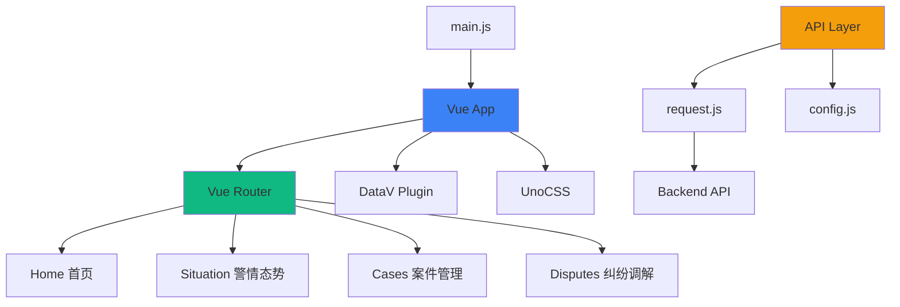

# Frontend - 警情态势演示系统前端

> **导航**: [← 返回根目录](../CLAUDE.md) / Frontend
> **模块职责**: 数据可视化、用户交互、地图展示
> **技术栈**: Vue 3 + Vite + DataV + UnoCSS + 天地图 API

---

## 📋 模块概述

前端采用 Vue 3 + Vite 构建，使用 DataV Vue3 进行数据可视化，UnoCSS 实现原子化样式。系统包含首页、警情态势、案件管理、纠纷调解四个主要页面。

### 关键特性
- 🗺️ 天地图集成 - 可视化社区警情分布
- 📊 实时态势展示 - 案件和纠纷统计
- ⚠️ 超期提醒 - 红色高亮显示超期项目
- 🎨 警务蓝 UI - 科技感渐变、毛玻璃效果
- 🔄 响应式设计 - 适配不同屏幕尺寸

---

## 🏗️ 架构设计



---

## 📁 目录结构

```
frontend/
├── public/                # 静态资源
│   └── favicon.ico
│
├── src/
│   ├── main.js           # 应用入口
│   ├── App.vue           # 根组件
│   │
│   ├── router/           # 路由配置
│   │   └── index.js      # 路由定义
│   │
│   ├── views/            # 页面组件
│   │   ├── Home.vue      # 首页
│   │   ├── Situation.vue # 警情态势
│   │   ├── Cases.vue     # 案件管理
│   │   └── Disputes.vue  # 纠纷调解
│   │
│   ├── components/       # 通用组件
│   │   └── BackButton.vue # 返回按钮
│   │
│   ├── api/              # API 请求
│   │   ├── request.js    # Axios 封装
│   │   └── config.js     # 配置 API
│   │
│   └── data/             # Mock 数据
│       └── mockData.js   # 模拟数据
│
├── package.json          # 项目配置
├── vite.config.js        # Vite 配置
├── uno.config.js         # UnoCSS 配置
└── index.html            # HTML 模板
```

---

## 🔑 关键文件

### 1. `src/main.js` - 应用入口
**职责**: Vue 应用初始化、插件注册

```javascript
import { createApp } from 'vue'
import App from './App.vue'
import router from './router'
import datav from '@kjgl77/datav-vue3'
import 'virtual:uno.css'
import '@unocss/reset/tailwind.css'

const app = createApp(App)
app.use(router)
app.use(datav)
app.mount('#app')
```

**依赖**:
- Vue 3 核心
- Vue Router
- DataV Vue3
- UnoCSS

---

### 2. `src/router/index.js` - 路由配置
**职责**: 定义应用路由

```javascript
const routes = [
  { path: '/', name: 'Home', component: Home },
  { path: '/situation', name: 'Situation', component: Situation },
  { path: '/cases', name: 'Cases', component: Cases },
  { path: '/disputes', name: 'Disputes', component: Disputes }
]
```

**路由列表**:
| 路径 | 名称 | 组件 | 功能 |
|------|------|------|------|
| `/` | Home | Home.vue | 首页导航 |
| `/situation` | Situation | Situation.vue | 警情态势 |
| `/cases` | Cases | Cases.vue | 案件管理 |
| `/disputes` | Disputes | Disputes.vue | 纠纷调解 |

---

### 3. `src/views/Home.vue` - 首页
**职责**: 系统首页，提供导航入口

**功能**:
- 显示系统标题
- 三个功能模块入口
  - 警情态势
  - 案件管理
  - 纠纷调解
- 警务蓝渐变背景
- 毛玻璃卡片效果

**路由跳转**:
```javascript
router.push('/situation')  // 跳转到警情态势
router.push('/cases')      // 跳转到案件管理
router.push('/disputes')   // 跳转到纠纷调解
```

---

### 4. `src/views/Situation.vue` - 警情态势
**职责**: 展示警情态势地图和统计数据

**功能模块**:
1. **天地图集成**
   - 显示社区警情分布
   - 标记警情位置
   - 地图交互

2. **统计数据**
   - 今日警情数量
   - 本周警情趋势
   - 警情类型分布

3. **数据可视化**
   - 使用 DataV 组件
   - 图表展示
   - 实时更新

**依赖**:
- 天地图 API
- DataV 图表组件
- 后端 API（如有）

---

### 5. `src/views/Cases.vue` - 案件管理
**职责**: 展示案件列表和详情

**功能模块**:
1. **案件列表**
   - 案件编号
   - 案件类型
   - 案件状态
   - 办理进度
   - 超期提醒（红色高亮）

2. **筛选功能**
   - 按状态筛选
   - 按类型筛选
   - 按时间筛选

3. **案件详情**
   - 案件基本信息
   - 办理流程
   - 相关人员

**数据结构**:
```javascript
{
  id: "案件编号",
  type: "案件类型",
  status: "案件状态",
  progress: "办理进度",
  isOverdue: true/false,  // 是否超期
  createdAt: "创建时间",
  updatedAt: "更新时间"
}
```

---

### 6. `src/views/Disputes.vue` - 纠纷调解
**职责**: 展示纠纷调解列表和详情

**功能模块**:
1. **纠纷列表**
   - 纠纷编号
   - 纠纷类型
   - 调解状态
   - 调解进度
   - 超期提醒（红色高亮）

2. **筛选功能**
   - 按状态筛选
   - 按类型筛选
   - 按时间筛选

3. **纠纷详情**
   - 纠纷基本信息
   - 调解流程
   - 相关人员

**数据结构**:
```javascript
{
  id: "纠纷编号",
  type: "纠纷类型",
  status: "调解状态",
  progress: "调解进度",
  isOverdue: true/false,  // 是否超期
  createdAt: "创建时间",
  updatedAt: "更新时间"
}
```

---

### 7. `src/components/BackButton.vue` - 返回按钮
**职责**: 通用返回按钮组件

**功能**:
- 返回上一页
- 统一样式
- 可复用

**使用示例**:
```vue
<template>
  <BackButton />
</template>

<script setup>
import BackButton from '@/components/BackButton.vue'
</script>
```

---

### 8. `src/api/request.js` - Axios 封装
**职责**: HTTP 请求封装

**功能**:
- 请求拦截器
- 响应拦截器
- 错误处理
- 统一配置

```javascript
import axios from 'axios'

const request = axios.create({
  baseURL: '/api',
  timeout: 10000
})

// 请求拦截器
request.interceptors.request.use(config => {
  // 添加 token 等
  return config
})

// 响应拦截器
request.interceptors.response.use(
  response => response.data,
  error => {
    console.error('请求错误:', error)
    return Promise.reject(error)
  }
)

export default request
```

---

### 9. `src/api/config.js` - 配置 API
**职责**: 配置管理相关 API

**接口列表**:
```javascript
// 获取天地图 API Key
export const getTiandituKey = () => request.get('/v1/config/tianditu-key')

// 设置天地图 API Key
export const setTiandituKey = (key) => request.post('/v1/config/tianditu-key', { key })

// 获取高德地图 API Key
export const getAmapKey = () => request.get('/v1/config/amap-key')

// 设置高德地图 API Key
export const setAmapKey = (key) => request.post('/v1/config/amap-key', { key })
```

---

### 10. `src/data/mockData.js` - Mock 数据
**职责**: 提供模拟数据用于开发和演示

**数据类型**:
- 警情数据
- 案件数据
- 纠纷数据
- 统计数据

**使用场景**:
- 开发阶段
- 演示阶段
- 后端未就绪时

---

## 🎨 样式设计

### UnoCSS 配置 (`uno.config.js`)
```javascript
export default defineConfig({
  presets: [
    presetUno(),
    presetAttributify(),
    presetIcons({
      collections: {
        ri: () => import('@iconify-json/ri/icons.json').then(i => i.default)
      }
    })
  ],
  theme: {
    colors: {
      'police-blue': '#1e3a8a',
      'police-light': '#3b82f6'
    }
  }
})
```

### 颜色主题
- **主色调**: `#1e3a8a` (police-blue) - 深蓝色
- **辅助色**: `#3b82f6` (police-light) - 亮蓝色
- **渐变**: 蓝色系渐变，营造科技感
- **毛玻璃**: `backdrop-filter: blur()` 效果

### 常用样式类
```css
/* 渐变背景 */
.bg-gradient-to-br from-police-blue to-police-light

/* 毛玻璃效果 */
.backdrop-blur-md bg-white/10

/* 卡片样式 */
.rounded-lg shadow-lg p-6

/* 超期提醒 */
.text-red-500 font-bold
```

---

## 🔧 Vite 配置

### `vite.config.js`
```javascript
export default defineConfig({
  plugins: [
    vue(),
    UnoCSS()
  ],
  resolve: {
    alias: {
      '@': fileURLToPath(new URL('./src', import.meta.url))
    }
  },
  server: {
    port: 3000,
    open: true,
    proxy: {
      '/api': {
        target: 'http://localhost:8000',
        changeOrigin: true,
        secure: false
      }
    }
  }
})
```

**配置说明**:
- **端口**: 3000
- **自动打开**: 启动后自动打开浏览器
- **API 代理**: `/api` 代理到后端 `http://localhost:8000`
- **路径别名**: `@` 指向 `src` 目录

---

## 📦 依赖管理

### 核心依赖
```json
{
  "dependencies": {
    "@kjgl77/datav-vue3": "^1.7.0",  // 数据可视化
    "vue": "^3.4.0",                  // Vue 3
    "vue-router": "^4.6.4"            // 路由
  }
}
```

### 开发依赖
```json
{
  "devDependencies": {
    "@iconify-json/ri": "^1.2.7",     // Remix Icon
    "@unocss/reset": "^0.58.0",       // CSS Reset
    "@vitejs/plugin-vue": "^5.0.0",   // Vue 插件
    "unocss": "^0.58.0",              // 原子化 CSS
    "vite": "^5.0.0"                  // 构建工具
  }
}
```

---

## 🚀 开发指南

### 启动开发服务器
```bash
npm run dev
```
访问: http://localhost:3000

### 构建生产版本
```bash
npm run build
```
输出目录: `dist/`

### 预览生产版本
```bash
npm run preview
```

---

## 📝 开发规范

### Vue 3 Composition API
```vue
<script setup>
import { ref, onMounted } from 'vue'

const data = ref([])

onMounted(() => {
  // 初始化逻辑
})
</script>
```

### 组件命名
- 使用 PascalCase: `BackButton.vue`
- 多词组件名: `UserProfile.vue`

### 样式规范
- 优先使用 UnoCSS 原子类
- 避免内联样式
- 使用 scoped 样式

### 代码风格
- 使用 ESLint
- 使用 Prettier
- 2 空格缩进

---

## 🔌 API 集成

### 请求示例
```javascript
import { getTiandituKey } from '@/api/config'

// 获取天地图 API Key
const fetchKey = async () => {
  try {
    const { key } = await getTiandituKey()
    console.log('API Key:', key)
  } catch (error) {
    console.error('获取失败:', error)
  }
}
```

### 错误处理
```javascript
try {
  const data = await apiCall()
  // 处理数据
} catch (error) {
  // 错误处理
  console.error('API 错误:', error)
  // 显示错误提示
}
```

---

## 🗺️ 天地图集成

### 初始化地图
```javascript
// 加载天地图 API
const loadTiandituAPI = (key) => {
  return new Promise((resolve, reject) => {
    const script = document.createElement('script')
    script.src = `http://api.tianditu.gov.cn/api?v=4.0&tk=${key}`
    script.onload = resolve
    script.onerror = reject
    document.head.appendChild(script)
  })
}

// 创建地图
const initMap = () => {
  const map = new T.Map('mapDiv')
  map.centerAndZoom(new T.LngLat(122.3, 30.0), 13)
  return map
}
```

### 添加标记
```javascript
const addMarker = (map, lng, lat, title) => {
  const marker = new T.Marker(new T.LngLat(lng, lat))
  marker.setTitle(title)
  map.addOverLay(marker)
  return marker
}
```

---

## 📊 DataV 组件使用

### 边框装饰
```vue
<template>
  <dv-border-box-1>
    <div>内容</div>
  </dv-border-box-1>
</template>
```

### 数字翻牌器
```vue
<template>
  <dv-digital-flop :config="config" />
</template>

<script setup>
const config = {
  number: [123],
  content: '{nt}件'
}
</script>
```

### 滚动列表
```vue
<template>
  <dv-scroll-board :config="config" />
</template>

<script setup>
const config = {
  header: ['编号', '类型', '状态'],
  data: [
    ['001', '盗窃', '已办结'],
    ['002', '纠纷', '办理中']
  ]
}
</script>
```

---

## 🐛 常见问题

### Q: 地图不显示？
A: 检查天地图 API Key 是否正确配置。

### Q: 样式不生效？
A: 确保 UnoCSS 已正确引入，检查 `uno.config.js` 配置。

### Q: API 请求失败？
A: 检查后端服务是否启动，检查 Vite 代理配置。

### Q: 路由跳转不工作？
A: 确保使用 `router.push()` 而不是 `<a>` 标签。

---

## 📚 相关资源

- [Vue 3 文档](https://vuejs.org/)
- [Vite 文档](https://vitejs.dev/)
- [DataV Vue3](https://github.com/kjgl77/datav-vue3)
- [UnoCSS 文档](https://unocss.dev/)
- [天地图 API](https://lbs.tianditu.gov.cn/)
- [Remix Icon](https://remixicon.com/)

---

## 🔄 更新日志

### v1.0.0 (2026-01-22)
- ✅ 初始版本
- ✅ 四个主要页面
- ✅ 天地图集成
- ✅ DataV 可视化
- ✅ UnoCSS 样式
- ✅ API 集成

---

## 📋 开发规则

### RULE
- 使用 Vue 3 Composition API
- 使用 DataV Vue3 进行数据可视化
- 使用 UnoCSS 原子化样式
- 逐个页面开发
- 小步迭代
- 一个页面完成再去写下一个页面相关的
